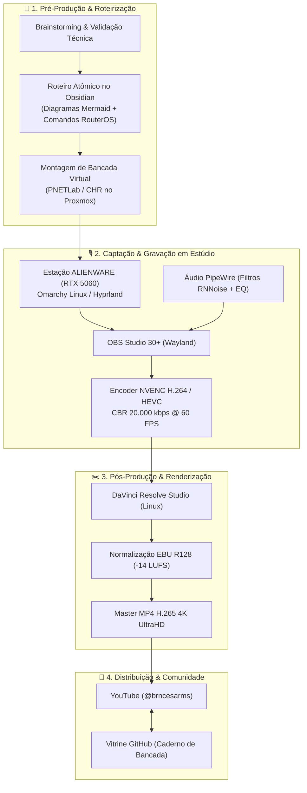

# 🎬 Pipeline de Produção Audiovisual & Engenharia de Estúdio

> [!info] Blueprint técnico do ecossistema de produção do canal [@brncesarms](https://youtube.com/@brncesarms): captação de tela 4K via OBS Studio, áudio profissional com PipeWire no Linux, aceleração por hardware NVIDIA NVENC e pós-produção determinística.

---

## 🧭 1. Fluxo Integrado de Produção (End-to-End)

---

## ⚙️ 2. Especificações de Captação no OBS Studio

### Configuração de Vídeo
- **Resolução Base (Canvas):** 3840x2160 (4K UHD) ou 2560x1440 (2K QHD).
- **Taxa de Quadros:** 60 FPS estáveis para máxima fluidez em janelas do terminal e Winbox.
- **Encoder:** `ffmpeg_nvenc` com preset `p6: slower (better quality)` e `tune=hq`.
- **Controle de Taxa:** CQP 18 (Gravação local com fidelidade absoluta de texto).

### Arquitetura de Áudio (PipeWire & Pro-Audio)
- **Taxa de Amostragem:** 48 kHz / 24-bit.
- **Cadeia de Plugins:**
  1. **Filtro Passa-Altas (High-Pass):** Corte em 80 Hz para eliminação de ruídos mecânicos e vibração de mesa.
  2. **Supressor de Ruído:** `RNNoise` nativo para isolar o ruído de fundo dos fans.
  3. **Compressor:** Proporção 3:1 com ataque rápido e liberação suave.
  4. **Limitador de Pico:** Teto absoluto em -1.0 dBFS para evitar distorção digital.

---

## 🖥️ 3. Integração com a Tríade Omarchy

- **Laptop ACER Aspire:** Roteirização, anotações de bancada no Obsidian e testes rápidos de scripts.
- **Workstation ALIENWARE:** Gravação pesada de tela 4K com aceleração gráfica na RTX 5060, emulação de roteadores e renderização no DaVinci Resolve.
- **Servidor GEEKOM A7 MAX:** Host do cluster de laboratório (PNETLab / MikroTik CHR) acessível via túnel WireGuard/Tailscale.

---

## 🔗 Notas Relacionadas
- [Diretrizes Editoriais e Framework de Roteirização](04_diretrizes_editoriais_e_roteirizacao.md) — Estrutura didática de retenção e roteiros.
- [Aula 01: O Novo Ecossistema MikroTik em 2026](01_introducao_ecossistema_mikrotik_2026.md) — Primeira aula do curso prático.
- [Linux: Transcodificação com FFmpeg e NVENC](../linux/08_ffmpeg_nvenc_transcodificacao.md) — Parâmetros corporativos de encoder.
- [Guia Principal do Canal YouTube](README.md) — Índice geral do canal e materiais complementares.
