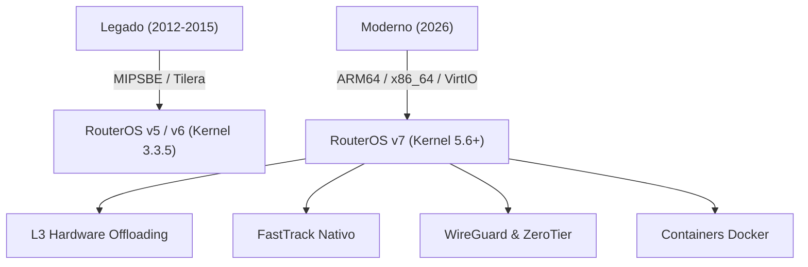

# 🚀 Aula 01: O Novo Ecossistema MikroTik em 2026

> **Série:** Curso MikroTik Básico 2026  
> **Episódio:** #01  
> **Vídeo no YouTube:** [@brncesarms](https://youtube.com/@brncesarms)  
> **Tópicos:** Evolução do Hardware, RouterOS v7, L3HW Offloading, Virtualização CHR  

---

## 🎯 Visão Geral da Transformação (2012-2015 ➔ 2026)

Durante mais de uma década, o mercado associou a MikroTik às lendárias caixas com arquitetura **MIPSBE** (como as RB750 e RB450G) ou processadores multinúcleo **Tilera** (linha CCR1000). Em 2026, esse cenário mudou radicalmente:

- ❌ **Hardware Obsoleto:** Processadores MIPSBE com pouca memória RAM e chips Tilera proprietários (descontinuados).
- ✅ **Padrão Moderno:** Arquitetura **ARM64** (linhas CCR2000, RB5009, L009) entregando altíssima eficiência energética e suporte a containers Docker nativos.
- ⚡ **L3 Hardware Offloading:** Roteamento e filtragem executados na velocidade do silício dos switch-chips (Marvell Prestera / Realtek), poupando 100% da CPU.



---

## 💻 Sistema Operacional: RouterOS v7

O **RouterOS v7** não é uma simples atualização cosmética; trata-se de um sistema totalmente reconstruído sobre o **Kernel Linux moderno (5.6+)**:

> [!NOTE] Principais Avanços do RouterOS v7
> 1. **Novo Routing Engine:** OSPFv3 e BGP totalmente reescritos com tabelas de roteamento dinâmicas e suporte a IPv4 + IPv6 unificados.
> 2. **WireGuard Nativo:** Túneis criptografados de alta performance substituindo o antigo e inseguro PPTP.
> 3. **Bridge VLAN Filtering Moderno:** Uma única bridge com hardware offloading substitui o modelo arcaico de múltiplas bridges.
> 4. **Winbox 4 Multiplataforma:** Cliente de gerência oficial reescrito para rodar nativamente em Linux, macOS e Windows sem necessidade de Wine.

---

## 🖥️ Bancada de Laboratório: MikroTik CHR no PNETLab

Para os estudos práticos e simulação de topologias avançadas sem a necessidade de comprar dezenas de equipamentos físicos, utilizamos o **MikroTik Cloud Hosted Router (CHR)**:

- **Plataforma:** PNETLab 4.2 rodando em cluster Proxmox VE.
- **Drivers de Rede:** Interfaces paravirtualizadas `VirtIO` para máxima vazão de pacotes por segundo.
- **Licenciamento Gratuito:** O CHR em modo *Free* opera com todas as funcionalidades do RouterOS v7 liberadas (limitado a 1 Mbps por interface, perfeito para bancada de estudo).

---

## 🧭 Comandos de Verificação Rápida no RouterOS v7

```routeros
# Inspecionar versão do sistema e arquitetura da CPU
/system/resource/print

# Inspecionar licença ativa e limite de banda do nó CHR
/system/license/print

# Verificar interfaces de rede disponíveis
/interface/print
```

---

## 🔗 Navegação & Notas Relacionadas
- ➡️ [Avançar para Aula 02: Endereçamento IPv4 & Máscaras CIDR](02_enderecamento_ipv4_e_mascaras_cidr.md)
- 📋 [Caderno de Bancada & Índice Geral](README.md)
- 🌐 [Redes: Comandos Básicos de Proteção MikroTik](../redes/02_mikrotik/02_mikrotik_firewall/01_basico_para_proteger_seu_mikrotik.md)
- 🧰 [Redes: Acesso SSH ao MikroTik via Linux](../redes/02_mikrotik/01_mikrotik_basico/12_acesso_ssh_mikrotik_via_terminal_linux.md)

