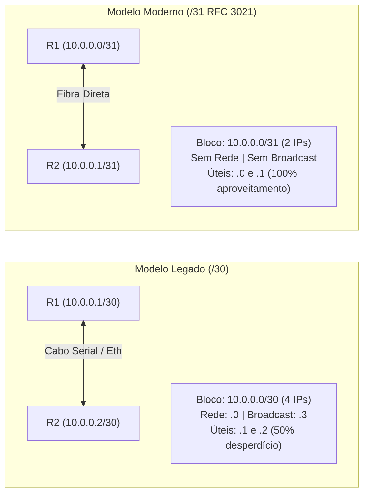

# 🌐 Aula 02: Endereçamento IPv4 & Notação CIDR sem Decoreba

> **Série:** Curso MikroTik Básico 2026  
> **Episódio:** #02  
> **Vídeo no YouTube:** [@brncesarms](https://youtube.com/@brncesarms)  
> **Tópicos:** Anatomia do IPv4, Notação CIDR, Potências de 2, RFC 1918, CGNAT RFC 6598, Erro do /32, Enlace /31  

---

## 🏛️ 1. A Morte do Modelo Classful & Adoção do CIDR

Esqueça o conceito arcaico de **Classes A, B e C** criado na RFC 791 (1981). Esse modelo causou o rápido esgotamento de endereços e foi oficialmente aposentado em **1993** pela RFC 1519 com a introdução do **CIDR (Classless Inter-Domain Routing)**.

Em redes modernas e provedores de internet, alocamos blocos com o tamanho exato necessário através do prefixo de bits de rede:

$$\text{Tamanho do Bloco} = 2^{(32 - \text{prefixo})}$$

---

## 🧠 2. O Método Mental das Potências de 2 (/24 a /32)

No dia a dia da bancada e em projetos de telecom, você não converte binários no papel. A regra de ouro dos engenheiros seniores é a matriz decrescente de potências de dois a partir do `/24`:

| Prefixo CIDR | Máscara Decimal | Total de IPs ($2^{32-\text{prefixo}}$) | IPs Úteis (Hosts) | Cenário de Aplicação Típico |
|:---:|:---:|:---:|:---:|:---|
| **/24** | `255.255.255.0` | **256** | **254** | LAN Corporativa, Wi-Fi Visitantes, Escolas |
| **/25** | `255.255.255.128` | **128** | **126** | Divisão de departamento grande em 2 sub-redes |
| **/26** | `255.255.255.192` | **64** | **62** | Sub-rede de servidores locais, VLAN Financeiro |
| **/27** | `255.255.255.224` | **32** | **30** | Racks de filial, VLAN de Câmeras CFTV |
| **/28** | `255.255.255.240` | **16** | **14** | Bloco de gerência corporativa, VLAN de switches |
| **/29** | `255.255.255.248` | **8** | **6** | Entrega de bloco de IPs públicos válidos a clientes |
| **/30** | `255.255.255.252` | **4** | **2** | Enlace Ponto a Ponto clássico (50% de desperdício) |
| **/31** | `255.255.255.254` | **2** | **2** | **Enlace PTP Moderno (RFC 3021)**: Zero desperdício! |
| **/32** | `255.255.255.255` | **1** | **1** | Interface Loopback, Host único, Regra de Firewall |

> [!TIP] Dica Mental Instantânea
> A cada bit somado na máscara (ex: de `/24` para `/25`), o bloco é cortado **exatamente pela metade**:
> $256 \to 128 \to 64 \to 32 \to 16 \to 8 \to 4 \to 2 \to 1$.

---

## 🔒 3. Faixas Privadas (RFC 1918) vs CGNAT (RFC 6598)

No planejamento de infraestrutura, os endereços são divididos em faixas públicas (roteáveis na internet) e faixas privadas/reservadas:

### 🏠 Redes Privadas de Uso Interno (RFC 1918)
- `10.0.0.0/8`: 16 milhões de IPs (backbone de operadoras, redes móveis, nuvens privadas).
- `172.16.0.0/12`: 1 milhão de IPs (ambientes de virtualização Proxmox, data centers).
- `192.168.0.0/16`: 65.536 IPs (redes residenciais, pequenas empresas).

### 🌐 Bloco de CGNAT de Provedor (RFC 6598)
- **Faixa:** `100.64.0.0/10` (de `100.64.0.0` até `100.127.255.255` - 4 milhões de IPs).

> [!IMPORTANT] Por Que Provedores ISP Não Podem Usar RFC 1918 na Entrega aos Clientes?
> Se o provedor entrega `192.168.1.x` na WAN do roteador do cliente, e o cliente também usa `192.168.1.x` na LAN da sua casa, ocorre um **conflito fatal de overlapping de rotas**. O tráfego do cliente não consegue navegar. O bloco `100.64.0.0/10` da RFC 6598 é imune a esse problema porque nenhum dispositivo doméstico usa essa faixa em sua LAN!

---

## ⚙️ 4. Prática no RouterOS v7 & O Perigo do /32 Acidental

No MikroTik RouterOS v7, a sintaxe oficial para atribuição de endereço é:

```routeros
# Cadastrar IP corretamente com a máscara CIDR
/ip/address/add address=192.168.10.1/24 interface=ether2 comment="LAN Corporativa"
```

> [!CAUTION] O Erro Fatal de Esquecer a Barra (/32 Acidental)
> Se você digitar apenas o IP sem a máscara CIDR:
> ```routeros
> /ip/address/add address=192.168.10.1 interface=ether2
> ```
> O RouterOS v7 assume automaticamente uma máscara **`/32`** (`255.255.255.255`)!
> **Sintoma do Desastre:** O roteador passa a enxergar apenas a si mesmo na interface. Nenhum computador da rede local conseguirá falar com o gateway, gerando falhas inexplicáveis para quem não conhece a regra da barra!

---

## 🚀 5. Enlaces PTP Modernos: /30 vs /31 (RFC 3021)



No RouterOS v7, você configura um enlace `/31` da seguinte forma:

```routeros
# Roteador R1
/ip/address/add address=10.0.0.0/31 network=10.0.0.1 interface=ether1 comment="PTP para R2"

# Roteador R2
/ip/address/add address=10.0.0.1/31 network=10.0.0.0 interface=ether1 comment="PTP para R1"
```

---

## 🔗 Navegação & Notas Relacionadas
- ⬅️ [Aula 01: O Novo Ecossistema MikroTik em 2026](01_introducao_ecossistema_mikrotik_2026.md)
- ➡️ [Aula 03: Arquitetura TCP/IP, Three-Way Handshake e ARP](03_arquitetura_tcp_ip_handshake_e_arp.md)
- 📋 [Caderno de Bancada & Índice Geral](README.md)
- 🌐 [Redes: IPs da Rede Interna](../redes/01_redes_basico/01_ips_rede_interna.md) — Tabela prática de blocos e gateway.
- 🌐 [Redes: Configuração de IP, Pool e DHCP no MikroTik](../redes/02_mikrotik/01_mikrotik_basico/01_ip_dns_pool_dhcp.md)

