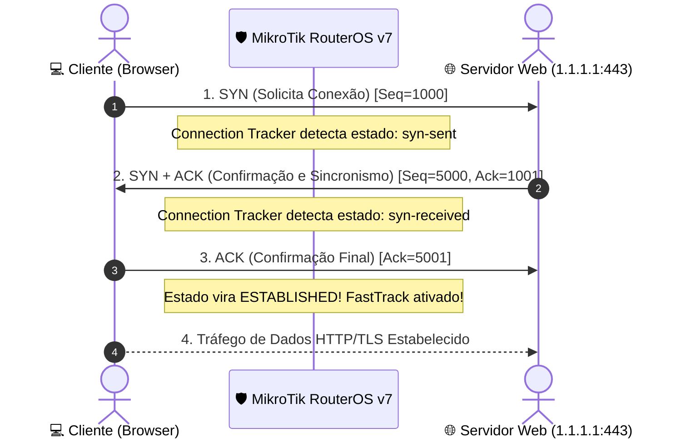

# 🤝 Aula 03: Arquitetura TCP/IP, Three-Way Handshake & Tabela ARP

> **Série:** Curso MikroTik Básico 2026  
> **Episódio:** #03  
> **Vídeo no YouTube:** [@brncesarms](https://youtube.com/@brncesarms)  
> **Tópicos:** 4 Camadas TCP/IP, Encapsulamento de Pacotes, Three-Way Handshake, Connection Tracking RouterOS v7, TCP vs UDP, Matriz de Portas, Protocolo ARP  

---

## 🌐 1. As 4 Camadas do Modelo TCP/IP & Encapsulamento

No mundo real de engenharia de redes e telecom, o modelo soberano é o **TCP/IP** (4 camadas), eliminando as camadas conceituais redundantes do modelo OSI:

| Camada TCP/IP | Unidade de Dados (PDU) | Protocolos & Serviços | Onde Atua no MikroTik? |
|:---:|:---:|:---|:---|
| **4. Aplicação** | **Dados** | HTTP/3 (QUIC), HTTPS, DNS, SSH, Winbox API | Serviços locais (`/ip/service`), Servidor Web, DoH |
| **3. Transporte (L4)** | **Segmento** | TCP (Confirmação / Janela) ou UDP (Velocidade) | Firewall Filter / NAT por porta (`src-port`, `dst-port`) |
| **2. Internet (L3)** | **Pacote** | Protocolo IP (IPv4 / IPv6), ICMP, TTL, MTU | **Roteamento Principal**: Tabela de Rotas (`/ip/route`) |
| **1. Acesso à Rede (L2)** | **Frame** | Ethernet 802.3, Wi-Fi 6 (802.11ax), MAC, ARP | Bridge, VLANs, Switch-chip L2 Hardware Offloading |

### 📦 Anatomia do Encapsulamento Real

```text
[ Cabeçalho Ethernet (L2) ]  -> MAC Origem: Cliente | MAC Destino: MikroTik
  [ Cabeçalho IPv4 (L3) ]    -> IP Origem: 192.168.10.50 | IP Destino: 1.1.1.1 | TTL: 64
    [ Cabeçalho TCP (L4) ]   -> Porta Origem: 52410 | Porta Destino: 443 | Flags: SYN/ACK
      [ Carga Útil (L7) ]    -> Dados da Aplicação Criptografados (TLS)
```

> [!NOTE] A Regra de Ouro do Roteador
> O switch lê apenas o cabeçalho Ethernet (L2). O roteador MikroTik **desencapsula** o frame Ethernet, lê o cabeçalho IP (L3), **decrementa o TTL** (evitando loops eternos), consulta a tabela de rotas para decidir a interface de saída e **reencapsula** o pacote em um novo frame Ethernet com o MAC do próximo salto!

---

## 🤝 2. O Three-Way Handshake & A Tabela de Conexões no RouterOS v7

Antes de qualquer byte de dados úteis trafegar via TCP, o cliente e o servidor sincronizam seus números de sequência através do clássico aperto de mão em 3 vias:



### ⚡ O Segredo do Connection Tracking & FastTrack

O firewall do MikroTik RouterOS v7 é um **Stateful Firewall**. Ele mantém uma tabela dinâmica de todas as sessões ativas:

```routeros
# Inspecionar sessões TCP ativas no firewall do RouterOS v7
/ip/firewall/connection/print detail where tcp-state=established
```

> [!TIP] O Milagre do FastTrack
> Quando uma conexão atinge o estado `established`, o MikroTik ativa a flag `F` (**FastTrack**). A partir desse momento, os pacotes subsequentes são encaminhados diretamente pelo Kernel do Linux, ignorando a árvore de regras pesadas de firewall e reduzindo o uso de CPU para quase zero!

---

## ⚖️ 3. TCP versus UDP: Quando Usar Cada Um?

| Característica | TCP (Transmission Control Protocol) | UDP (User Datagram Protocol) |
|---|---|---|
| **Orientação** | Orientado a Conexão (Stateful) | Não Orientado a Conexão (Stateless) |
| **Confiabilidade** | 100% Confiável (Retransmite perdas) | Best Effort (Não retransmite perdas) |
| **Controle de Fluxo** | Sim (Janela Deslizante / Congestion Control) | Não |
| **Tamanho do Cabeçalho** | 20 bytes (com Flags SYN, ACK, FIN, RST) | Apenas 8 bytes (Ultra leve) |
| **Casos de Uso em 2026** | Web (HTTPS), SSH, Winbox, Bancos, Arquivos | Streaming ao Vivo, Jogos Online, DNS, VoIP, **QUIC (HTTP/3)** |

---

## 🚪 4. Matriz de Portas Conhecidas no RouterOS v7 (0 a 65535)

Para que o roteador saiba exatamente para qual serviço direcionar cada segmento, utilizamos números de portas lógicas:

| Porta | Protocolo | Serviço | Descrição Técnica no MikroTik |
|:---:|:---:|:---|:---|
| **8291** | `TCP` | **Winbox** | Porta proprietária de gerência do MikroTik RouterOS. |
| **22** | `TCP` | **SSH** | Acesso ao terminal seguro (CLI) e automações com chaves criptográficas. |
| **53** | `UDP/TCP` | **DNS** | Consultas de nomes de domínio e cache de DNS local do RouterOS. |
| **443** | `TCP/UDP` | **HTTPS / QUIC** | Tráfego web seguro e HTTP/3 moderno rodando sobre UDP. |
| **80** | `TCP` | **HTTP** | Web desprotegida (geralmente redirecionada para HTTPS). |
| **67 / 68** | `UDP` | **DHCP Server / Client** | Distribuição dinâmica de endereços IP na rede local. |

---

## 🔍 5. O Protocolo ARP: A Ponte Crítica entre L3 (IP) e L2 (MAC)

Um dos maiores desafios conceituais de iniciantes é compreender como o roteador entrega o pacote na rede local:

> [!IMPORTANT] O Dilema L3 vs L2
> O roteador sabe que o destino do pacote é o IP `192.168.10.50` (Camada 3). Porém, no cabo de rede ou no Wi-Fi, a placa de rede **só responde ao seu endereço físico MAC** (Camada 2)!

### 📢 O Ciclo de Funcionamento do ARP (Address Resolution Protocol)

1. **ARP Request (Broadcast):**  
   O computador ou roteador envia um quadro para o endereço MAC broadcast `FF:FF:FF:FF:FF:FF`:  
   *"Quem tem o endereço IP 192.168.10.1? Responda para 192.168.10.50!"*
2. **ARP Reply (Unicast):**  
   O roteador MikroTik escuta o broadcast e responde diretamente ao solicitante:  
   *"Eu sou o 192.168.10.1 e o meu endereço físico MAC é 50:00:00:01:00:02!"*
3. **Cache Dinâmico (Tabela ARP):**  
   Ambos gravam esse relacionamento na memória para não sobrecarregar a rede com broadcasts.

### 🛡️ Prática no RouterOS v7 & Hardening de Provedor

```routeros
# Visualizar a tabela ARP dinâmica no MikroTik
/ip/arp/print

# Flags: D - DYNAMIC, C - COMPLETE
# 0  DC  192.168.10.50  50:00:00:01:00:01  ether2
# 1  DC  192.168.10.20  50:00:00:02:00:01  ether2
```

> [!WARNING] Técnica de Segurança de Provedor: ARP Reply-Only
> Se você alterar a interface local para `arp=reply-only`, o MikroTik responderá apenas aos dispositivos cadastrados estaticamente na tabela ARP:
> ```routeros
> /interface/ethernet/set ether2 arp=reply-only
> ```
> Isso impede que clientes mal-intencionados configurem IPs manuais para furar o DHCP ou cometerem ataques de ARP Spoofing!

---

## 🔗 Navegação
- ⬅️ [[02_enderecamento_ipv4_e_mascaras_cidr|Aula 02: Endereçamento IPv4 & Máscaras CIDR]]
- ➡️ [[README|Voltar ao Índice do Curso]]
