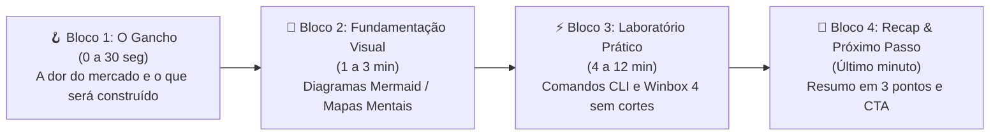

# 📚 Diretrizes Editoriais & Framework de Roteirização

> [!info] Metodologia didática e framework de estruturação de aulas técnicas para o canal [@brncesarms](https://youtube.com/@brncesarms), focada em alta retenção, clareza conceitual com diagramas visuais e laboratórios 100% reproduzíveis.

---

## 🧭 1. Framework dos 4 Blocos de Retenção

Cada aula técnica do canal é desenhada seguindo a estrutura de 4 blocos progressivos:

### Detalhamento dos Blocos:
1. **O Gancho (Hook Imediato):** Sem vinhetas longas ou saudações demoradas. Apresentação imediata do problema real enfrentado por provedores ou engenheiros de infraestrutura e a demonstração do resultado final funcionando.
2. **Fundamentação Visual (Conceito):** O conceito teórico é explicado com diagramas em blocos (Mermaid), tabelas comparativas e analogias diretas de engenharia, eliminando decoreba teórica.
3. **Hands-on de Bancada (Prática Real):** Execução passo a passo no terminal RouterOS v7 ou Winbox 4. Comandos documentados no caderno de bancada no Obsidian.
4. **Recapitulativo & Próximo Passo:** Síntese do aprendizado e ponte lógica para o próximo episódio da série.

---

## 🛠️ 2. Padrões Inegociáveis de Conteúdo (Zero Gambiarras)

- **Tecnologia Atualizada (2026):** Foco estrito em **RouterOS v7**, arquiteturas modernas ARM64/x86_64, Winbox 4 multiplataforma e túneis WireGuard/Tailscale.
- **Transparência de Cenário:** Toda topologia de laboratório deve ser clara quanto ao endereçamento IP, interfaces e restrições de ambiente virtual.
- **Caderno de Bancada Aberto:** Os inscritos têm acesso aos exatos scripts e anotações exibidos na tela através do repositório público `canal-youtube` no GitHub.

---

## 🔗 Notas Relacionadas
- [Pipeline de Produção Audiovisual & Estúdio](00_pipeline_producao_audiovisual.md) — Infraestrutura técnica de hardware e software.
- [Aula 01: O Novo Ecossistema MikroTik em 2026](01_introducao_ecossistema_mikrotik_2026.md) — Aplicação prática do framework didático.
- [Aula 02: Endereçamento IPv4 e Máscaras CIDR](02_enderecamento_ipv4_e_mascaras_cidr.md) — Guia visual de cálculo de blocos.
- [Guia Principal do Canal YouTube](README.md) — Índice geral do canal e materiais complementares.
