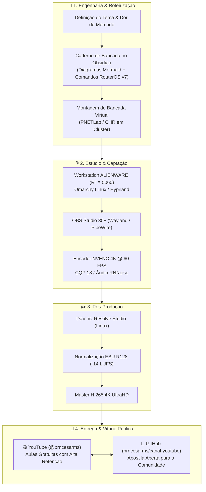

# 🌐 Canal YouTube @brncesarms: Engenharia de Redes & Caderno de Bancada

[-302E31?logo=obsstudio&logoColor=white)](https://obsproject.com)

Repositório público oficial do canal [`@brncesarms`](https://youtube.com/@brncesarms), mantido por **Bruno César**.

Atua como o **Caderno de Bancada Aberto** e centro de documentação técnica para alunos, inscritos e profissionais de telecomunicação, contendo roteiros atômicos, topologias visuais, diagramas em blocos, matrizes de cálculo e comandos práticos das aulas.

---

## 🏛️ Pipeline de Engenharia de Conteúdo & Produção Audiovisual

Da idealização da topologia até a entrega do vídeo final em 4K UltraHD:

---

## 📖 Catálogo de Notas & Materiais Complementares

### ⚙️ Engenharia de Estúdio & Diretrizes
- 🎬 [Pipeline de Produção Audiovisual & Estúdio](./00_pipeline_producao_audiovisual.md) — Configurações de OBS, PipeWire, filtros de áudio e encoder NVENC.
- 📚 [Diretrizes Editoriais & Framework de Roteirização](./04_diretrizes_editoriais_e_roteirizacao.md) — Metodologia didática dos 4 blocos de retenção.

### 🔷 Curso MikroTik Básico 2026: Do Zero ao BGP
| Aula | Assunto | Roteiro Completo & Caderno de Bancada | Destaques Técnicos |
|:---:|:---|:---|:---|
| **01** | Ecossistema Moderno | [01 - O Novo Ecossistema MikroTik em 2026](./01_introducao_ecossistema_mikrotik_2026.md) | Transição MIPSBE para ARM64, Kernel 5.6+, L3HW Offloading e CHR |
| **02** | IPv4 & Subnetting | [02 - Endereçamento IPv4 & Notação CIDR sem Decoreba](./02_enderecamento_ipv4_e_mascaras_cidr.md) | Método mental das potências de 2, RFC 1918, CGNAT RFC 6598 e Enlace `/31` |
| **03** | Arquitetura TCP/IP | [03 - Arquitetura TCP/IP, Three-Way Handshake & Tabela ARP](./03_arquitetura_tcp_ip_handshake_e_arp.md) | Encapsulamento, Connection Tracking no RouterOS v7, portas e proteção `arp=reply-only` |

---

## 🛠️ Tecnologias & Ambiente de Bancada

- **Hardware Virtual:** MikroTik Cloud Hosted Router (CHR) no PNETLab / Proxmox VE.
- **Sistema Operacional de Roteamento:** MikroTik RouterOS v7.16+ (Kernel Linux 5.6+).
- **Gerenciamento:** Winbox 4 (Nativo Linux/macOS/Windows) & SSH com chaves Ed25519.
- **Estação de Trabalho:** Omarchy Linux (Hyprland / Tokyo Night).
- **Toolbox de Automação:** [`brncesarms/scripts`](https://github.com/brncesarms/scripts).

---

## 🔗 Repositórios Relacionados no Ecossistema

- 🌐 [redes](https://github.com/brncesarms/redes) — Topologias corporativas, OSPF, VPN Tailscale e Firewall Stateful.
- 🐧 [linux](https://github.com/brncesarms/linux) — Transcodificação FFmpeg com NVENC, SO e virtualização KVM.
- 🪟 [windows](https://github.com/brncesarms/windows) — Configurações de estações de trabalho e OpenSSH.
- 🤖 [ia](https://github.com/brncesarms/ia) — Inferência local e RAG com sqlite-vec.
- 🧰 [scripts](https://github.com/brncesarms/scripts) — Toolbox multiplataforma determinística.

---

## 📜 Licença

Distribuído sob a licença **MIT**. Consulte `LICENSE` para mais detalhes.  
Criado e mantido por **Bruno César** ([@brncesarms](https://github.com/brncesarms)).
